# Laporan Proyek Machine Learning - Rizky Maulana Saputra

## Domain Proyek

Energi Surya merupakan salah satu sumber energi terbarukan yang semakin banyak dimanfaatkan untuk memenuhi kebutuhan energi, terutama di sektor rumah tangga dan industri. Namun, pemanfaatan energi surya sangat bergantung pada intensitas radiasi matahari yang tidak selalu stabil dan dapat dipengaruhi oleh berbagai faktor cuaca seperti suhu, kelembapan, tekanan udara, dan waktu.

Oleh karena itu, prediksi radiasi matahari menjadi penting dalam rangka optimalisasi penggunaan panel surya, perencanaan daya pada sistem energi terbarukan, serta terbarukan, serta efisiensi distribusi energi. Dengan menggunakan pendekatan deep learning, kita dapat membangun model prediktif yang mampu mempelajari pola dari data historis cuaca untuk memperkirakan tingkat radiasi matahari di masa depan.

## Business Understanding

### Problem Statements

Menjelaskan pernyataan masalah latar belakang:
1. Masih terbatasnya sistem monitoring dan prediksi radiasi matahari secara real-time
2.  Belum ada benchmark yang jelas untuk model prediksi radiasi matahari berbasis deep learning pada dataset meteorologi terbuka

### Goals

Menjelaskan tujuan dari pernyataan masalah:
1. Mengembangkan sistem prediksi radiasi matahari berbasis deep learning yang memanfaatkan data historis
2. Menyediakan baseline hasil eksperimen yang dapat digunakan oleh peneliti atau praktisi lain dalam pengembangan sistem energi surya

### Solution statements
1. Mengembangkan model prediksi radiasi matahari menggunakan Deep Learning (Dense Layer)
Model ini dibangun dengan arsitektur feedforward neural network (dense) yang terdiri dari dari beberapa lapisan fullly connected yang bertujuan untuk mempelajari pola hubungan non-linier antara fitur fitur cuaca seperti suhu, kelembapan, tekanan udara dan lain-lainnya terhadap output berupa nilai radiasi
2. Melakukan hyperparameter tuning untuk meningkatkan performa model
dilakukan penyesuaian terhadap berbagai parameter seperti jumlah layer, jumlah neuron per layer, fungsi aktivasi, learning rate, jumlah epoch, dan batch size. Proses tuning ini bertujuan untuk memperoleh model dengan performa terbaik dalam memprediksi radiasi matahari.
3. Evaluasi model menggunakan metrik Mean Absolute Error (MAE) dan Mean Squared Error (MSE)
Metrik MAE digunakan untuk mengukur rata-rata selisih absolut antara nilai prediksi dan nilai aktual. Sementara MSE memberikan penalti lebih besar terhadap error yang besar, sehingga cocok untuk mengidentifikasi prediksi yang jauh meleset. Kedua metrik ini memberikan gambaran menyeluruh terhadap performa model regresi yang dibangun.

## Data Understanding
Dataset yang digunakan dalam proyek ini diambil dari Kaggle - Solar Energy, yang berisi data pengukuran kondisi cuaca dan radiasi matahari di berbagai waktu. Dataset ini digunakan untuk membangun model prediktif terhadap nilai radiasi matahari berdasarkan kondisi cuaca historis.  
Tautan Sumber Dataset :  
Solar Energy : https://www.kaggle.com/datasets/dronio/SolarEnergy.

### Variabel-variabel pada Solar Energy dataset adalah sebagai berikut:
Dataset memiliki 32.686 baris dan 11 kolom data yang merepresentasikan pengukuran harian atau periodik (tergantung preprocessing) dari variabel-variabel cuaca dan radiasi matahari. 
- UNIXTime : Waktu dalam format UNIX timestamp.
- Data : Format waktu yang telah di-decode dari UNIXTime.
- Radiation : Nilai radiasi matahari (target yang akan diprediksi).
- Temperature : Suhu udara pada waktu pengukuran.
- Pressure : Tekanan udara.
- Humidity : Kelembaban udara.
- WindDirection(Degrees) : Arah angin dalam derajat.
- Speed : Kecepatan angin.
- TimeSunRise, TimeSunSet : Waktu matahari terbit dan terbenam.
- Time : Waktu lokal dari pengukuran.
Kondisi Data : 
- Missing Values : Dilakukan pada Exploration Data Analysis yakni tidak terdapat missing values
- Duplicate Data : Dilakukan pada Exploration Data Analysis yakni tidak terdapat duplikat data
- Outlier : Dilakukan pada Exploration Data Analysis terlihat terdapat outlier yang sudah dilakukan feature engineering yakni : 
    - Kolom Radiation : 1965 outlier
    - Kolom Temperature : 89 outlier
    - Kolom Pressure : 1662 outlier
    - Kolom Humidity : 0 outlier
    - Kolom WindDirection(Degrees) : 1618 outlier
    - Kolom Speed : 479 outlier
    - Kolom SunRiseMinutes : 0 outlier
    - Kolom SunSetMinutes : 0 outlier
    - Kolom CurrentMinutes : 0 outlier
    - Kolom MinutesSinceSunrise : 0 outlier
    - Kolom MinutesUntilSunset : 0 outlier
    - Kolom DaylightDuration : 0 outlier

#### Exploratory Data Analysis
Untuk memahami karakteristik data secara lebih mendalam, dilakukan beberapa tahapan eksplorasi data sebagai berikut :
1. Pemeriksaan Struktur Data dan Missing Value : 
Dataset terdiri dari 32.686 baris dengan berbagai variabel cuaca seperti Temperature, Humidity, Wind Speed, Radiation sebagai target. Hasil pengecekan menunjukan bahwa tidak terdapat missing value pada dataset, sehingga tidak diperlukan penanganan khusus terdapat nilai kosong.
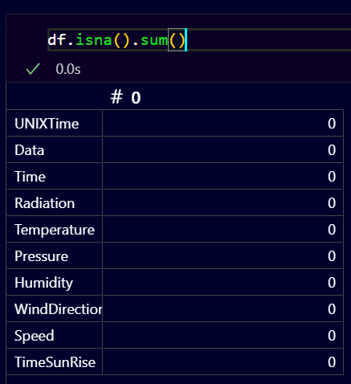
2. Statistik Deskriptif :  
Nilai rata - rata radiasi berkisar 207 W/m², dengan nilai max mendekati 1601 W/m². Ini menunjukan adanya variasi besar pada intensitas cahaya matahari sepanjang waktu pengamatan, kemungkinan dipengaruhi oleh waktu dalam sehari, musim dan kondisi cuaca
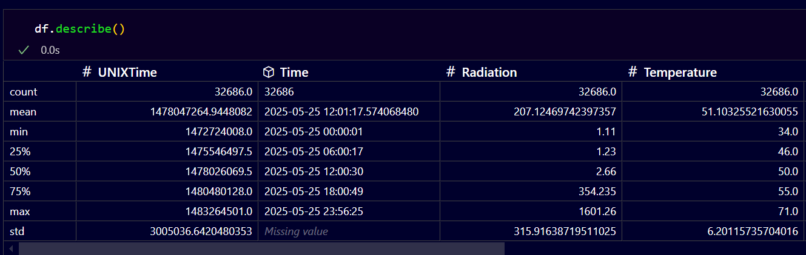
3. Distribusi Nilai Radiation : 
Visualisasi histogram menunjukkan bahwa distribusi Radiation cenderung right-skewed, yaitu sebagian besar nilai berada di rentang rendah (sekitar 0–200 W/m²), dan hanya sedikit yang mencapai angka sangat tinggi. Pola ini wajar karena intensitas matahari tertinggi hanya terjadi dalam waktu tertentu (misalnya, siang hari pada hari cerah).
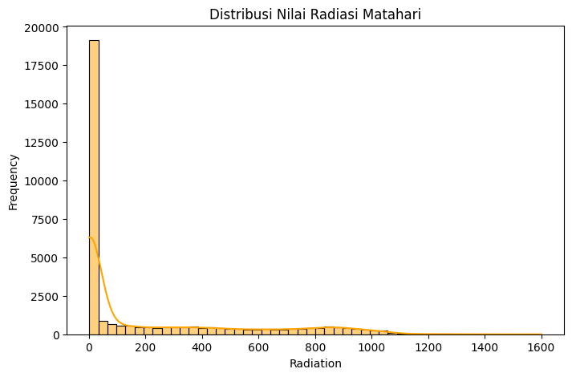
4. Korelasi Antar Fitur : 
Hasil perhitungan matriks korelasi menunjukkan bahwa:
    - Temperature memiliki korelasi positif yang cukup tinggi dengan Radiation (~0.63), yang masuk akal karena suhu biasanya meningkat seiring dengan meningkatnya radiasi matahari.
    - Humidity menunjukkan korelasi negatif terhadap Radiation, yang berarti semakin tinggi kelembaban, semakin rendah kemungkinan intensitas cahaya matahari (karena awan atau uap air menyerap sinar).
    - Fitur lain seperti Pressure, WindDirection, dan Speed menunjukkan korelasi yang lebih lemah terhadap target.
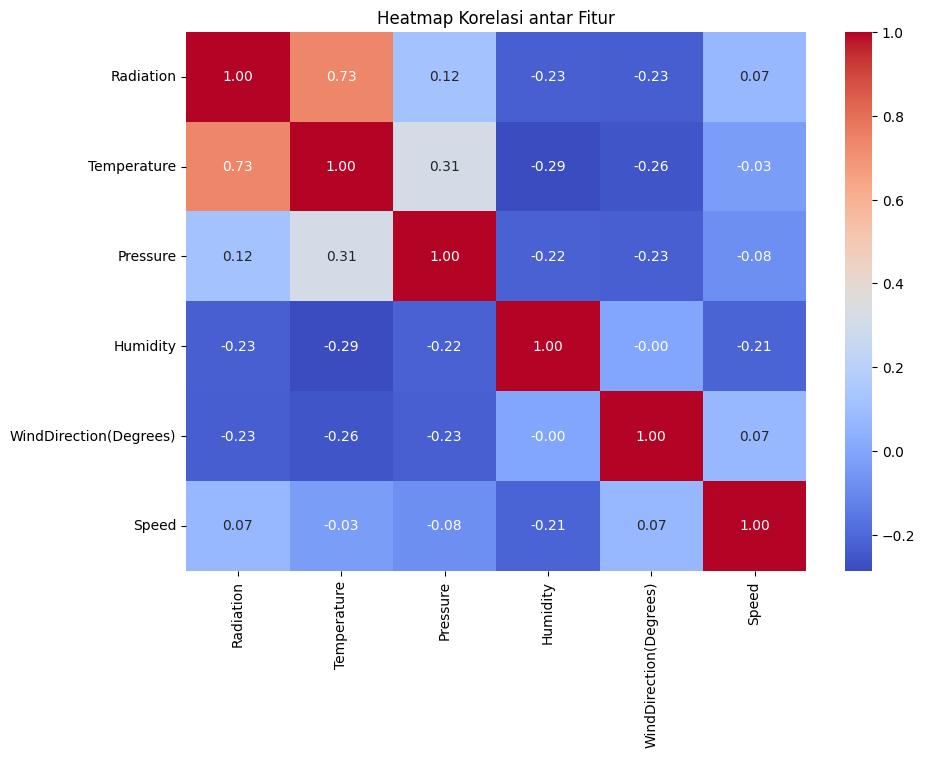
5. Insight Awal : 
Berdasarkan korelasi dan visualisasi, fitur Temperature dan Humidity menjadi kandidat kuat sebagai input penting untuk model prediksi. Distribusi yang tidak seimbang pada target Radiation juga perlu diperhatikan saat melakukan pemodelan karena dapat mempengaruhi performa model secara keseluruhan.

## Data Preparation
Pada tahap ini dilakukan beberapa proses untuk menyiapkan data sebelum dilatih menggunakan model deep learning tipe Dense(fully connected neural network). Tahapan - tahapan yang dilakukan meliputi : 
1. Seleksi dan Fitur Engineering : 
Berdasarkan hasil eksplorasi data (EDA), fitur - fitur yang digunakan selain fitur asli dari dataset seperti Temperature, Humidity, Pressure, WindDirection(Degrees), dan Speed, dilakukan penambahan fitur baru berdasarkan informasi waktu (Time, SunRise, dan SunSet). Fitur tambahan tersebut adalah :
    - SunRiseMinutes : Waktu matahari terbit dalam menit dari pukul 00:00
    - SunSetMinutes : Waktu matahari terbenam dalam menit dari pukul 00:00
    - CurrentMinutes : Waktu saat pengukuran dalam menit dari pukul 00:00
    - MinutesSinceSunRise : Selisih menit antara waktu sekarang dan waktu matahari terbit
    - MinuteUntilSunset : Selisih menit antara waktu matahari terbenam dan waktu sekarang
    - DaylightDuration : Durasi siang hari dalam menit
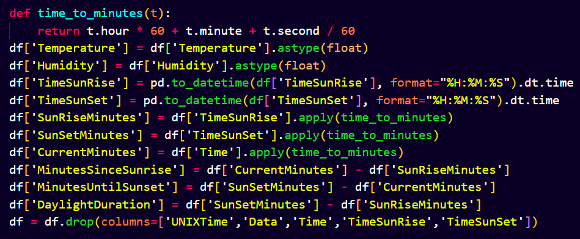
2. Handling Outlier : 
Untuk menjaga kualitas data yang masuk ke model, dilakukan normalisasi terhadap nilai - nilai ekstrem (outlier). Penanganan ini penting agar model tidak terdistraksi oleh data yang tidak representatif. Metode yang digunakan adalah clipping berdasarkan distribusi kuartil (IQR)
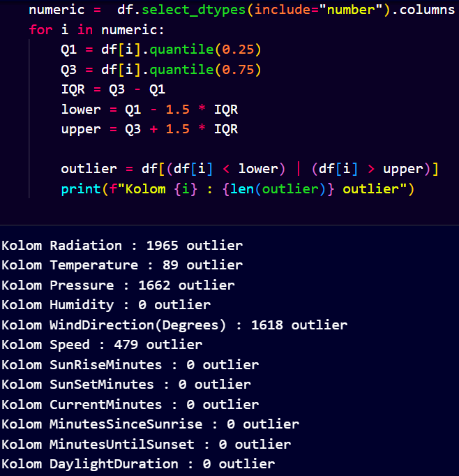
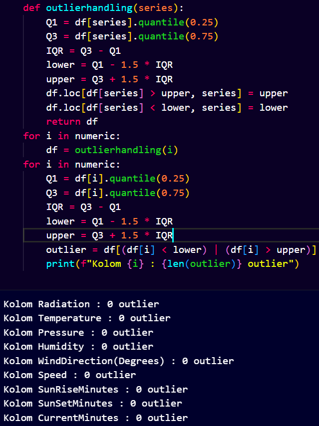
3. Seleksi Fitur dan Target :
Fitur dan Target yang digunakan dipisah terlebih dahulu pada variabel X sebagai fitur (Temperature, Humidity, Pressure, WindDirection(Degrees), Speed, SunRiseMinutes, SunSetMinutes, CurrentMinutes, MinuteUntilSunset and DaylightDuration) dan y sebagai target (Radiation)
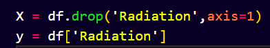
4. Split Data :
Melakukan splitting data menjadi dua yaitu Data training dan data testing yang dibagi sebesar 80:20
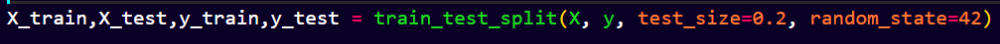
5. Normalisasi Fitur :
Untuk memastikan semua fitur memiliki skala yang sebanding, dilakukan normalisasi menggunakan StandardScaler dari sklearn.preprocessing. Metode ini mengubah distribusi fitur agar memiliki mean = 0 dan standard deviation = 1, sehingga mempercepat proses konvergensi model dan menghindari dominasi fitur tertentu.
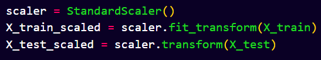

## Modeling
Model ini merupakan arsitektur Deep Neural Network (DNN) yang dibangun menggunakan Sequential dari Keras. Model terdiri dari beberapa lapisan Dense dengan fungsi aktivasi ReLU dan satu lapisan output untuk regresi. 
Langkah kerja model:
- Input Layer menerima fitur sebanyak X_train_scaled.shape[1].
- Hidden Layers: 
    - Lapisan bertingkat dari 32 → 64 → 128 → 256 → 512 neuron.

    - Semua menggunakan aktivasi ReLU untuk menangani vanishing gradient dan meningkatkan non-linearitas model.

- Output Layer: Satu neuron tanpa fungsi aktivasi (linear) karena target bersifat numerik (regresi).
- Optimisasi dilakukan dengan algoritma Adam, loss function menggunakan Mean Squared Error (MSE), dan metrik evaluasi tambahan adalah Mean Absolute Error (MAE).

Pembahasan Parameter
- Dense Neurons: 32, 64, 128, 256, 512 → jumlah neuron bertambah secara progresif untuk menangkap pola kompleks.
- Activation Function: ReLU untuk semua hidden layer (default).
- Output Activation: Linear (default, tanpa aktivasi).
- Optimizer: Adam (default setting).
- Loss Function: mse (default untuk regresi).
- Metrics: mae untuk interpretasi performa model.

1. Arsitektur Model :
Model awal dibangun menggunakan beberapa lapisan Dense, dengan struktur sebagai berikut:
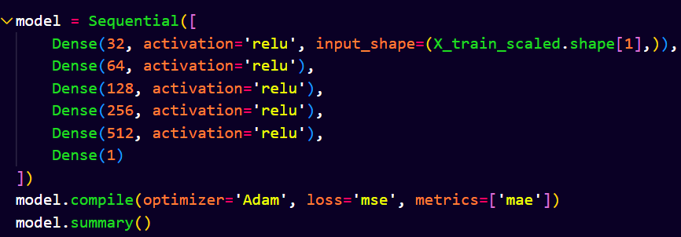

2. Proses Training :
Model dilatih dengan loss function Mean Squared Error (MSE) dan dioptimasi menggunakan algoritma Adam Optimizer. Evaluasi dilakukan menggunakan MAE
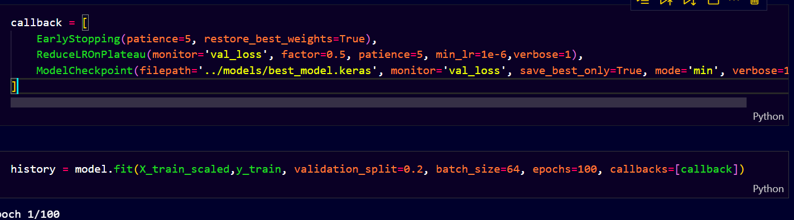

3. Tuning dan Improvement :
    - Menambahkan jumlah neuron dan layer untuk meningkatkan kapasitas model dalam menangkap pola kompleks
    - EarlyStopping dan Callbacks untuk mencegah overfitting dan mempercepat training
4. Callbacks yang digunakan:
    - EarlyStopping(patience=5, restore_best_weights=True): menghentikan training jika tidak ada perbaikan dalam 5 epoch.
    - ReduceLROnPlateau: menurunkan learning rate jika val_loss stagnan.
    - ModelCheckpoint: menyimpan model terbaik berdasarkan val_loss.
5. Kelebihan/Kekurangan 
Kelebihan: 
    - Arsitektur deep yang fleksibel untuk menangkap pola kompleks.
    - Callbacks mencegah overfitting dan meningkatkan efisiensi training.
Kekurangan: 
    - Rentan overfitting tanpa regularisasi tambahan.
    - Memerlukan data dalam jumlah besar untuk hasil optimal.

## Evaluation
Metrik Evaluasi 
Pada proyek ini digunakan dua metrik utama untuk mengevaluasi performa model regresi:

- Mean Absolute Error (MAE): Mengukur rata-rata selisih absolut antara nilai prediksi dengan nilai aktual. Metrik ini cocok untuk mengetahui seberapa jauh rata-rata prediksi meleset dari nilai sebenarnya tanpa penalti besar terhadap outlier.

- Mean Squared Error (MSE): Memberikan penalti lebih besar terhadap error yang besar (kuadrat dari selisih), sehingga cocok untuk mendeteksi prediksi yang jauh melenceng.

Kedua metrik dipilih karena mampu memberikan gambaran menyeluruh tentang kualitas prediksi model regresi, terutama dalam konteks prediksi radiasi matahari yang membutuhkan presisi tinggi.

Berdasarkan hasil training dengan model terbaik (dengan arsitektur dense 6-layer), diperoleh hasil evaluasi sebagai berikut:

- MAE Validation (akhir): val_mae = 38.78852462768555

- Rata-rata nilai aktual radiasi: y_test.mean() = 197.5109154175589

- Persentase MAE terhadap rata-rata:
→ Model menghasilkan MAE sekitar 19.64% dari rata-rata nilai aktual, yang menunjukkan bahwa model memiliki akurasi prediksi yang cukup baik untuk kebutuhan analisis radiasi matahari.

Visualisasi juga memperkuat hasil evaluasi melalui grafik berikut:

- Grafik Training vs Validation Loss (MSE)
- Grafik Training vs Validation MAE

Keduanya menunjukkan bahwa model tidak mengalami overfitting yang signifikan dan stabil selama proses pelatihan.

Hasil Evaluasi
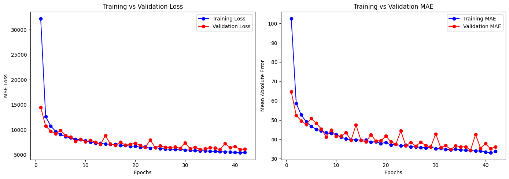

Apakah sudah menjawab setiap problem statement? 
✅ Ya. Model berhasil menjawab tantangan terbatasnya sistem prediksi radiasi matahari dengan membangun arsitektur deep learning berbasis data historis meteorologi. Selain itu, eksperimen ini menyediakan benchmark awal untuk model prediksi berbasis deep learning pada dataset terbuka.

Apakah berhasil mencapai setiap goals? 
✅ Ya. Tujuan untuk membangun sistem prediksi dan menyediakan baseline performa sudah tercapai. Model dapat digunakan sebagai titik awal pengembangan sistem energi surya berbasis prediksi.

Apakah setiap solusi statement yang direncanakan berdampak? 
✅ Ya.

- Solusi pengembangan model deep learning berhasil menghasilkan performa yang baik.

- Hyperparameter tuning mampu meningkatkan performa.

- Evaluasi menggunakan MAE & MSE memberikan validasi yang kuat bahwa model dapat digunakan untuk skenario dunia nyata.

**---Ini adalah bagian akhir laporan---**

